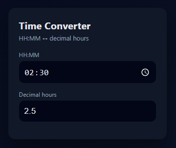

# HHMM-WebApp ⏱

[](LICENSE)  
[](https://www.netlify.com/)

A **mobile-first web app** to convert between **HH:MM** and **decimal hours**, with **offline support** as a **Progressive Web App (PWA)**. Works on both Android and iOS.

---

## Table of Contents

- [Features](#features)  
- [Demo](#demo)  
- [Getting Started](#getting-started)  
  - [Run Locally](#run-locally)  
  - [Deploy Online](#deploy-online)  
- [PWA Features](#pwa-features)  
- [File Structure](#file-structure)  
- [Screenshots](#screenshots)  
- [How It Works](#how-it-works)  
- [Tech Stack](#tech-stack)  
- [License](#license)  

---

## Features

- **Bidirectional conversion**: HH:MM ↔ decimal hours  
- **Mobile-first design**: optimized for touch screens  
- **Progressive Web App (PWA)**: installable on Android & iOS  
- **Offline-ready**: works without an internet connection after first load  
- **Lightweight**: pure HTML, CSS, and JavaScript, no frameworks  
- **Simple deployment**: works on Netlify or any static host  

---

## Demo


Try it live: [https://hhmm-webapp.netlify.app/]()

---

## Getting Started

### Run Locally

#### Option A — Open directly

Open `index.html` in your browser.  

> ⚠️ PWA/offline features **require HTTP(S)**, so direct file access will not fully work.

#### Option B — Local server (recommended for offline/PWA)

1. Make sure Python is installed.  
2. Run the Windows batch file:

```bash
start-server.bat
